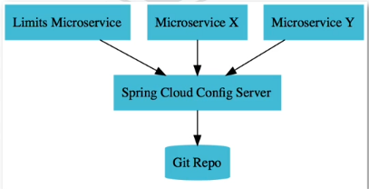
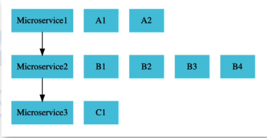

### Microservices

1. Monolith
- một ứng dụng lớn trong kiến trúc Monolith:
   
    1. khó deploy (một thay đổi nhỏ cần phải deploy cả khối lớn),
    
    2. dẫn đến thời gian release kéo dài,
    
    3. khả năng mở rộng hạn chế (ứng dụng lớn nên mở rộng quy mô sẽ tốn nhiều tài nguyên, toàn bộ ứng dụng cần mở rộng ngay cả khi chỉ có 1 phần của nó cần nhiều dung lượng hơn)
    
    4. sự cố định về công nghệ, toàn bộ ứng dụng được xây dựng trên một nền tảng công nghệ duy nhất dẫn đến việc áp dụng công nghệ mới trở thành thách thức
⇒ microservices

2. Microservices
   
   1. là những services nhỏ, độc lập và hoạt động cùng nhau

   2. mỗi service chạy quy trình riêng và giao tiếp với nhau thường thông qua API

   3. các service này có thể được viết bằng các ngôn ngữ lập trình khác nhau và có thể sử dụng các công nghệ lưu trữ dữ liệu khác nhau
   
4. Lợi ích 

   1. Tính linh hoạt: có thể áp dụng công nghệ và quy trình mới cho từng service. Dễ dàng hơn trong khi thử và chuyển đổi công nghệ

   3. Khả năng mở rộng động: chỉ mở rộng các service cần thiết, giảm chi phí 

   4. Quá trình release nhanh hơn: các service nhỏ và độc lập có thể developed, tested, deployed nhanh hơn

5. Thách thức và giải pháp

   1. Spring Cloud 

      1. Centralized configuration: quản lý các cấu hình của các microservices trong GIT  repository
      
      

      2. Load balancing (cân bằng tải): giúp phân phối các request một cách linh hoạt
      
      

      3. Service discovery: tự động phát hiện các microservices
         
      4. Distributed tracing: giúp xác định chính xác service nào khi nó xảy ra lỗi và điều gì đang gây ảnh hưởng tới performance của ứng dụng.
         
      5. Edge server: gần người dùng, nó giống như gateway, một điểm vào duy nhất (single entry point) cho các microservices
             
      6. Fault tolerance: khả năng chịu lỗi: một microservice bị lỗi không ảnh hưởng đến service khác 

   3. Docker
      - triển khai nhất quán các service, 
      - làm cho ngôn ngữ lập trình và môi trường trở nên độc lập

   4. Kubernetes
   
      - cung cấp service discovery, load balancing, release mgmt,...
     

## Khi nào nên dùng microservice:

| Nếu bạn cần... | Microservice là tốt nhất |
|:---|:---|
| Rất nhiều team cùng phát triển 1 hệ thống lớn | ✅ |
| Cần scale từng phần khác nhau trong hệ thống | ✅ |
| Cần đảm bảo khi 1 phần lỗi, hệ thống vẫn chạy | ✅ |
| Cần nhanh chóng update, deploy liên tục (CI/CD) | ✅ |
| Cần cho phép chọn công nghệ phù hợp từng phần | ✅ |

## so sánh Monolith và Microservice 

| Vấn đề nếu dùng 1 ứng dụng to ("Monolith") | Microservice giải quyết như thế nào |
|:---|:---|
| Càng lớn càng nặng: mỗi lần deploy, phải build và deploy **toàn bộ hệ thống** | Microservice chia nhỏ thành từng module riêng biệt. **Deploy service nào chỉ build service đó.** |
| Mỗi team phải đụng chung vào cùng 1 project codebase -> **xung đột** | Mỗi service là 1 codebase, team A làm User Service, team B làm Payment Service, **không đụng nhau**. |
| Khi lỗi, **cả hệ thống sập** dù lỗi chỉ ở 1 phần | Khi lỗi 1 service (ví dụ Chat Service down), các service khác (đặt hàng, thanh toán) **vẫn chạy**. |
| Scale (mở rộng) tốn tài nguyên: scale toàn hệ thống | Scale từng service độc lập. Ví dụ: chỉ cần **scale Search Service**, không cần scale hết app. |
| Công nghệ bị khóa cứng: ví dụ cả hệ thống bắt buộc xài Java | Mỗi service tự chọn tech stack: Search dùng Go, Payment dùng Java, AI dùng Python, tùy team. |
| Update khó khăn: cập nhật 1 tính năng mới phải test toàn hệ thống | Microservice update từng service nhỏ. Ít ảnh hưởng. |
